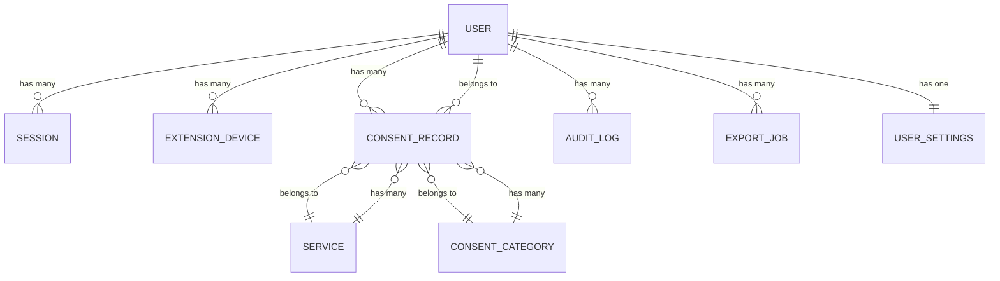
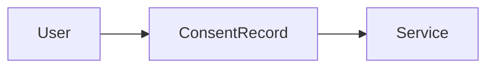
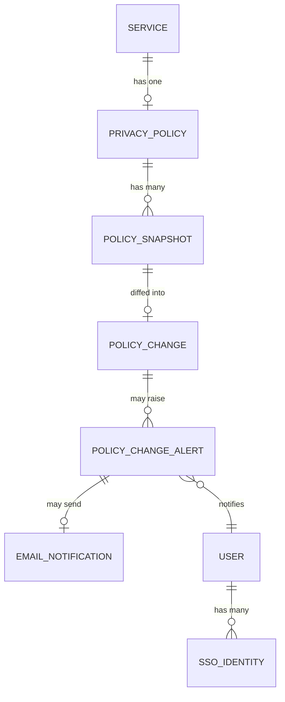
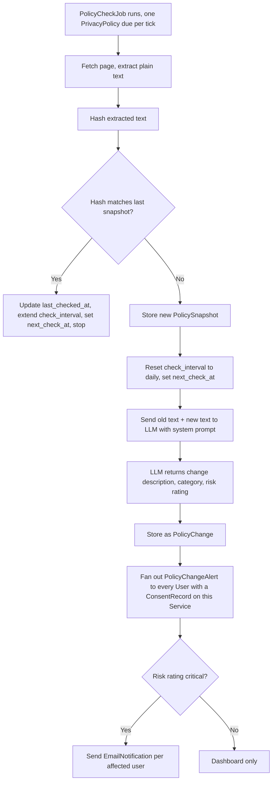
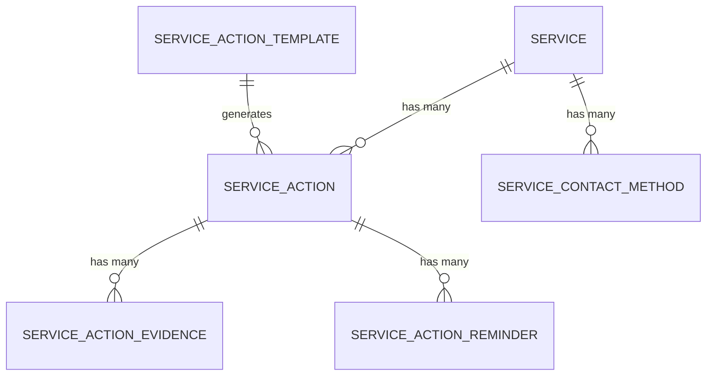

# Domain model

This is the data model behind PermissionLedger, organised by release.

## Release 1

```text
User
Session
ExtensionDevice
Service
ConsentRecord
ConsentCategory
AuditLog
ExportJob
UserSettings
```



The core relationship, the one everything else hangs off, is:



Each user has their own private permission history, and each record points to the service that received that permission.

**`Service` is shared, not owned by a user.** I changed this from the original plan, where each user had their own private `Service` rows. If two users both have a record against Stripe, they need to point at the same `Service` row, not two separate copies. This is what makes the Release 2 monitoring design work: a privacy policy belongs to a service, not to a user, so the policy only needs to be tracked once no matter how many users have a record against it. New services get created the first time any user references them (by matching on domain, not on the free-text name they typed), and from then on every user referencing that domain shares the same `Service` row. A user's own data, the date they agreed, their notes, their risk assessment, still lives entirely on their own `ConsentRecord`. Only the service identity itself is shared.

## Release 2

```text
PrivacyPolicy
PolicySnapshot
PolicyChange
PolicyCheckJob
PolicyChangeAlert
EmailNotification
SsoIdentity
```



This is how the app tracks a service's privacy policy over time: one policy can have many snapshots, a snapshot comparison produces a change, and a change can produce an alert. A `PolicyChangeAlert` is generated once per change but fans out to every user with a `ConsentRecord` against that service, since the underlying check, fetch and LLM call only happen once regardless of how many users are watching.

### Checking centrally, not per user

If two thousand users each save a record against the same service, the policy should be fetched and diffed once a day, not two thousand times. `PrivacyPolicy` belongs to `Service`, never to a user or a `ConsentRecord` directly. The check runs as a separate scheduled worker, not inside the request-serving API, since the API is intended to scale to zero when idle and an in-process scheduler would never wake to run on a quiet night. The worker selects due policies with `WHERE next_check_at <= now()` and processes them. Fan-out to individual users happens only at the alert stage, after a change has already been confirmed. The deployment shape for this worker (an Azure Container Apps Job on a cron, or a min-replicas-1 worker) is covered in Phase 12 of [ROADMAP.md](./ROADMAP.md).

This depends on `Service` being a shared row rather than a per-user one, which is why that change to the Release 1 model matters here too.

### Tiered polling instead of a flat daily schedule

Checking every tracked policy every day doesn't scale once the number of tracked services grows, and most policies sit unchanged for months at a time. Each `PrivacyPolicy` row carries a `check_interval`, a `last_checked_at`, a `last_changed_at` and a `next_check_at`. A policy that hasn't changed in several checks moves to a longer interval: daily, then weekly, then monthly. The first change after a quiet period resets it back to daily for a short window, since companies sometimes amend a change shortly after publishing it. This is the same idea as backoff in any polling system, and it's what keeps the fetch volume manageable as the number of tracked services climbs into the thousands rather than staying in the dozens.

`next_check_at` is stored directly rather than computed on the fly from `last_checked_at + check_interval`. The scheduled worker's "what's due now" query is then a single indexed `WHERE next_check_at <= now()` rather than a computed comparison across every row, which matters once the table holds thousands of policies. Each check updates `last_checked_at`, recalculates `next_check_at` from the new interval, and updates `last_changed_at` only when the hash actually changed.

### Hash before diff, diff before LLM call

Two separate gates keep cost down. The fetch step stores a hash of the extracted plain text, not the raw HTML, since markup changes constantly even when wording doesn't. If the hash matches the last snapshot, the check stops there: no diff, no LLM call, just an updated `last_checked_at`. Only a changed hash triggers a snapshot and a diff, and only a non-trivial diff triggers the LLM call. The LLM call is the expensive step in the pipeline and should never run on every check, only on confirmed changes.

### A shared registry for well-known services

A small curated table of known privacy policy URLs for major services (the large platforms most users will have records against) lets the system start tracking a service's policy before any user has explicitly added it. When a new user creates a record against a service already in the registry, they inherit its existing snapshot history immediately instead of starting from zero. This is the same underlying idea as the guided offboarding links planned for Release 3, a shared, curated layer of service-level data sitting alongside the per-user records, so it's worth building as one piece of infrastructure rather than two.

### On webhooks

Some large platforms publish changelogs for policy updates, but there's no standard for this and most sites offer nothing. A product built around companies proactively notifying a third-party consent tracker isn't realistic for early versions of PermissionLedger. Polling with backoff, not webhooks, is the practical approach until the user base is large enough that direct integrations with individual services become worth pursuing.

### Policy check and ranking flow

This is the pipeline behind the "AI-assisted" ranking: a scheduled job, two cost gates, and an LLM call that only fires on confirmed, meaningful change. No model runs inside the Rust binary; the LLM call is a stateless HTTP request.



The system prompt sent with each LLM call should ask it to do two things, not one: describe what changed in plain language, and assign a category and risk rating from a fixed set of values. Keeping the categories and risk levels as a closed list, rather than free text, is what makes the dashboard's filters and counts possible. The risk values are `low`, `medium`, `high` and `critical`. A formatting change is low. A new clause about sharing data with advertising partners is high. Anything touching health data, financial data, location data or children's data is critical.

## Release 3

```text
ServiceAction
ServiceActionTemplate
ServiceActionEvidence
ServiceActionReminder
ServiceContactMethod
```



This tracks what the user does after reviewing a service: withdrawing consent, requesting account deletion, asking for data to be deleted, and the evidence attached to that request.

## A note on SQLx and schema changes

SQLx checks queries against a live database at compile time, so every schema change needs a migration applied to the local and CI databases before the backend will build. This is worth keeping in mind when adding tables for Release 2 and 3: the migration has to land and run before the corresponding Rust code will compile, not after.
